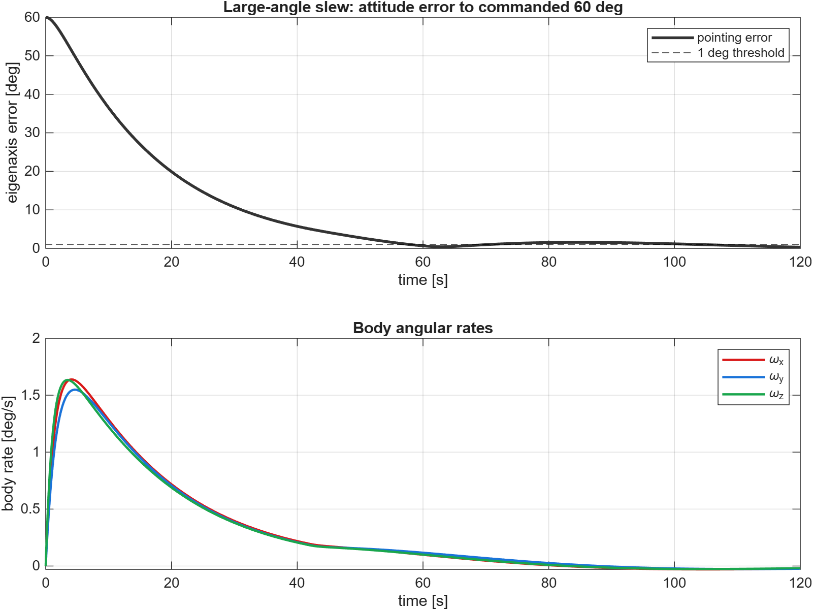
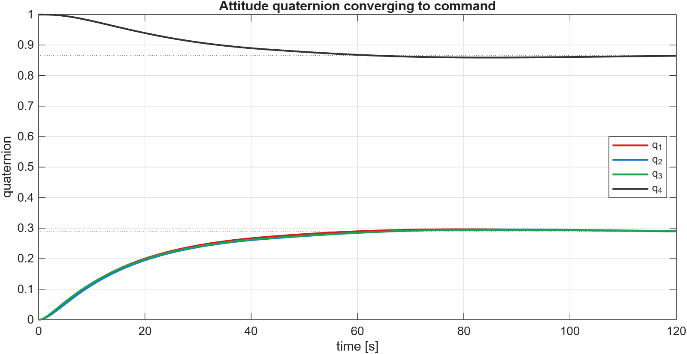
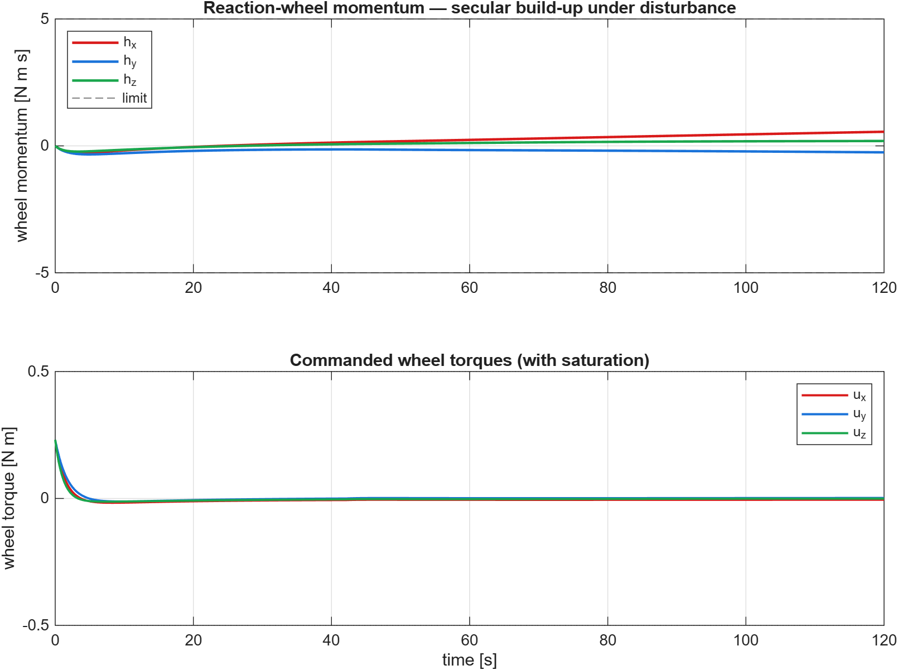

# Reaction-Wheel Satellite Attitude Control (ADCS)

Quaternion-feedback attitude control of a rigid spacecraft using three
body-axis reaction wheels. The satellite performs a large-angle (60°)
rest-to-rest eigenaxis slew under a quaternion PID law with conditional-
integration anti-windup. Wheel torque and momentum limits are enforced,
and a constant external disturbance drives a secular wheel-momentum
build-up that motivates momentum management (desaturation).

**Author:** Ali Murtaza · **Type:** Personal project · **Period:** May-Jun 2026
**Tools:** MATLAB R2026a (no toolboxes required). Optional STK scenario for
3D visualisation (run in the STK GUI).

## Model & control
- **Dynamics:** `J·ω̇ = −ω×(J·ω + h) + u + τ_d`, `ḣ = −u`, quaternion kinematics `q̇ = ½Ω(ω)q` (scalar-last). RK4 at 50 Hz.
- **Plant:** `J = diag(10, 12, 8) kg·m²`; wheel limits `u_max = 0.5 N·m`, `h_max = 5 N·m·s`; disturbance `τ_d = [5, −2, 1]·10⁻³ N·m`.
- **Control:** `u = Kp·q_e,vec + Ki·∫q_e,vec − Kd·ω`, with the integrator gated on (error < 5°) to prevent slew windup.

## Results (verified run)

| Metric | Value |
|---|---|
| Commanded slew | 60° about [1,1,1]/√3 eigenaxis |
| Slew settling (first < 1°) | 57.9 s |
| Max post-slew disturbance transient | 1.6° |
| Final pointing error | 0.30° |
| Peak body rate | 2.77°/s |
| Wheel momentum at 120 s | [0.56, −0.25, 0.19] N·m·s (limit 5) |

The integral term nulls the steady-state pointing bias the disturbance
would otherwise impose, while the wheels accumulate momentum at ≈ the
disturbance torque - the trigger for a desaturation cycle on a real mission.

### Figures
| | |
|---|---|
|  |  |
|  | |

## Run it
```matlab
cd src
reaction_wheel_adcs
```
Outputs include `adcs_quaternion.csv`, used to drive the interactive 3D web viewer.

## What this demonstrates
Quaternion attitude representation and kinematics, nonlinear rigid-body
dynamics with reaction-wheel coupling, quaternion-feedback PID control,
anti-windup via conditional integration, actuator saturation handling, and
reaction-wheel momentum management.

## License
MIT - see [LICENSE](LICENSE).
